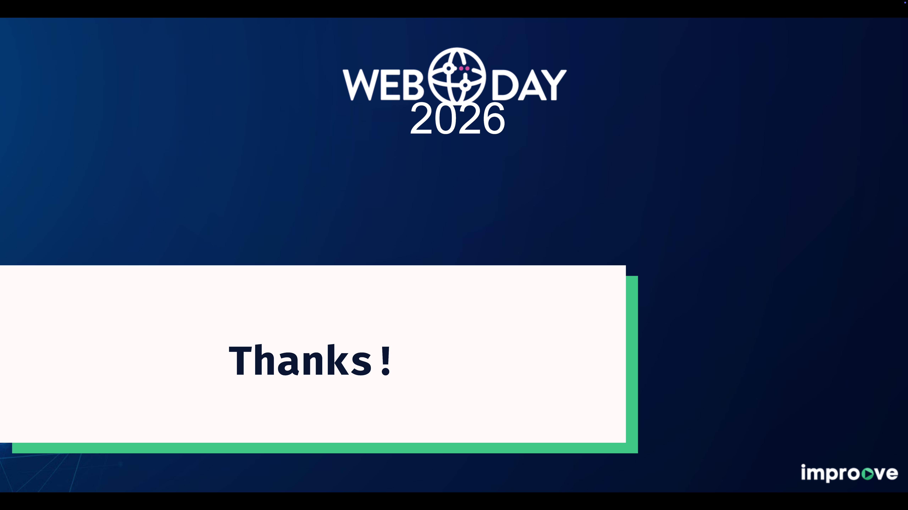

slidenumbers: false


---


---

# Hello!

**Matteo Ronchi**
Software Architect @ WorkWave
25 years in Web Development

[github.com/cef62](https://github.com/cef62)
[linkedin.com/in/matteoronchi](https://www.linkedin.com/in/matteoronchi/)

---

# AI coding tools are everywhere

MCP Servers · Autonomous agents · AI IDEs · Plugins

More capability = **more need for structure**.

^ The gap between assistant and autonomous is shrinking fast. Every major IDE now has agent-like features. The question isn't "should I use AI?" — it's "how do I stay in control while it does more?"

---

# My story

I spent the last year testing SDD frameworks,
building training programs, and shipping production code
with AI agents.

**Some things worked. Some didn't.**

This talk is what I wish someone had told me
before I started.

---

# What is a Spec?

> ### A structured, behavior-oriented document that describes software functionality in natural language.

^ Not a prompt. Not documentation written after the fact. A spec is the contract between you and the AI agent before any code gets written.

---

# Not Just a Prompt 

A prompt is a **one-shot instruction**
A spec is a **persistent agreement**

```
Prompt: "Add user authentication"

Spec:   Requirements, behaviors, edge cases,
        constraints, testing strategy —
        all in one reviewable artifact.
```

---

# Spec Example

```markdown
## Feature: User Authentication

### Requirements
- Sign up with email/password
- Password: 8+ chars, 1 number, 1 special
- Max 5 failed attempts → 15-min lockout

### Behavior
- Success → redirect to dashboard
- Failure → show error, increment counter
- Lockout → show countdown timer

### Edge Cases
- Expired session during submit
- Concurrent login attempts
```

---

# Spec ≠ Memory Bank

Two different concepts. Both matter.

| Memory Bank                 | Spec                   |
| --------------------------- | ---------------------- |
| Cross-session context       | Task-specific contract |
| Coding rules, patterns      | Feature requirements   |
| Shared across all tasks     | Guides one feature     |
| `CLAUDE.md`, `.cursorrules` | `spec.md`, `plan.md`   |

Memory Banks **feed** your specs.
Specs **focus** your agent.

^ Think of it this way: the memory bank tells the agent "how we build things here." The spec tells the agent "what we're building right now."

---

# The SDD Premise

> "Specs describe intent. Agents generate code."

**You write:** WHAT and WHY
**The agent writes:** HOW

This is the core idea. 
Everything else is tooling.

---

# SDD Levels

Birgitta Böckeler (Thoughtworks) defined three adoption levels:

**Spec-first** → write spec, generate code, maybe discard spec
**Spec-anchored** → spec evolves with the feature over time
**Spec-as-source** → humans only edit specs, never touch code

Today, **spec-first** is the only level with mature tooling.

^ Böckeler's taxonomy from martinfowler.com is now the standard framework. Spec-as-source is where Tessl is heading, but it's still in closed beta. Most teams in 2026 are doing spec-first.

---

# The SDD Workflow

```
┌──────────┐     ┌──────┐     ┌───────┐     ┌───────────┐
│ Specify  │ ──▶ │ Plan │ ──▶ │ Tasks │ ──▶ │ Implement │
└──────────┘     └──────┘     └───────┘     └───────────┘
```

Each stage produces an artifact that guides the next.

**Specify:** Requirements, behaviors, edge cases
**Plan:** Architecture decisions, component design
**Tasks:** Ordered, atomic steps with dependencies
**Implement:** One task at a time. Review. Commit. Repeat.

---

# Plan Mode ≠ SDD

Every AI coding tool has a plan mode now.
It's useful, but it's not the same thing.

|                | Plan Mode         | SDD                |
| -------------- | ----------------- | ------------------ |
| **Artifact**   | Ephemeral         | Persistent         |
| **Scope**      | Single session    | Multi-session      |
| **Format**     | Freeform          | Structured         |
| **Reviewable** | By you, right now | By the team, later |

^ Plan mode is great for everyday tasks. SDD is for when the work needs to survive beyond your current session — when other people (or future you) need to understand what was built and why.

---

# The Tool Landscape

Four tools worth knowing in 2026:

🔷 **Amazon Kiro** — opinionated IDE with built-in SDD
🔷 **GitHub Spec Kit** — open-source, agent-agnostic (74k+ ⭐)
🔷 **spec-workflow-mcp** — MCP server with web dashboard
🔷 **Superpowers** — methodology framework (84k+ ⭐)

And one more option: **no framework at all**.

^ I'll give you a quick tour of each, then spend the rest of the talk on the approach I actually use day to day.

---

# Amazon Kiro

A VS Code fork with the most opinionated SDD workflow.

**Requirements → Design → Tasks**
Uses EARS notation. Human review gates at every step.

✅ Great onboarding for SDD concepts
⚠️ Can over-engineer small tasks
⚠️ Locked to the Kiro IDE

Böckeler's observation: fixing a small bug generated
**4 user stories with 16 acceptance criteria.**

^ Kiro reached GA in November 2025. It's the best tool to understand what a full SDD workflow looks like — even if you end up not using it daily.

---

# GitHub Spec Kit

Open-source Python CLI. Works with **22+ AI agents**.

**Constitution → Specify → Plan → Tasks → Implement**

The "Constitution" concept is powerful:
project-level immutable principles that constrain every spec.

✅ Agent-agnostic
✅ Rich ecosystem (VS Code extension, Microsoft Learn course)
⚠️ Generated specs can be verbose
⚠️ Python dependency

^ Spec Kit is the dominant open-source option. The Constitution concept is something I've adopted even when not using Spec Kit — defining project-level boundaries up front saves enormous rework.

---

# spec-workflow-mcp

An MCP server — works inside any MCP-compatible tool.

**Steering → Specifications → Implementation → Verification**

✅ Real-time web dashboard 
✅ VSCode extension for review and approval
⚠️ MCP compatibility required

^ If your team already uses MCP servers, this fits naturally. The web dashboard is genuinely useful for reviewing specs — better than reading raw markdown files.

---

# Superpowers

Not strictly an SDD tool.
A **methodology encoded as agent skills**.

Core patterns that matter:
- Plan with atomic tasks
- Git worktree isolation per task
- Subagent-driven implementation with self-review
- TDD enforcement (red-green-refactor)

✅ The patterns are universal — adopt them anywhere 
✅ Works across Claude Code, Codex, Gemini CLI

^ Here's the key insight: you don't need to install Superpowers to benefit from it. The methodology — atomic tasks, isolated branches, self-review checklists — works with any tool.

---

# What Superpowers Does Right

The framework enforces three ideas:

1. **Plans are small.** Each task = 2-5 minutes of agent work.
2. **Review is mandatory.** Inline self-review catches 3-5 bugs in ~30 seconds.
3. **Isolation is cheap.** Git worktrees mean one branch per task.

I adopted all three as personal practice.
I don't always run Superpowers to do it.

---

# The No-Framework Path

Every modern AI tool already has SDD infrastructure.

**Claude Code:** `CLAUDE.md` + `/plan` + skills + subagents
**Cursor:** `.cursorrules` + plan mode + background agents
**Copilot:** `copilot-instructions.md` + coding agent
**Windsurf:** `.windsurfrules` + Cascade

You're probably already doing lightweight SDD.
You just haven't formalized it.

---

# CLAUDE.md as SDD Foundation

```
project/
├── CLAUDE.md              ← Project memory bank
├── .claude/
│   └── rules/
│       ├── frontend.md    ← Scoped rules per area
│       └── testing.md
├── specs/
│   └── auth-feature/
│       ├── spec.md        ← Feature spec
│       ├── plan.md        ← Implementation plan
│       └── tasks.md       ← Ordered task list
└── src/
```

No framework. No dependencies. Just markdown and discipline.

^ This is the structure I use most often. The CLAUDE.md provides the memory bank, scoped rules handle area-specific patterns, and a specs/ directory holds the living feature documents.

---

# Writing Specs That Work

Addy Osmani's principles for AI agent specs:

1. **Be behavior-oriented** — describe what, not how to
2. **Define boundaries** — Always / Ask first / Never
3. **Include edge cases** — the AI might skip them 
4. **Keep it atomic** — one concern per section
5. **Write for the agent** — think "Agent Experience," not documentation

^ Osmani calls this "AX" — Agent Experience. Design specs for agent consumption the same way we design APIs for developer experience.

--- 

## More detailed ≠ always better.
### Too many directives and the AI follows none well.


---

# Demo 1: SDD with a Framework

**spec-workflow-mcp in action**

`[VIDEO — ~3-4 minutes]`

^ SPEAKER NOTE — What to record: Start with a concrete feature requirement (e.g., "Add a search filter component with debounced input"). Show the spec-workflow-mcp web dashboard. Walk through: (1) Steering setup with project context, (2) Spec generation from the requirement — pause to show the generated spec structure, (3) Plan generation — show how it breaks the work into ordered steps, (4) Execute one task — show the agent writing code from the plan, (5) Quick look at the Kanban-like progress view. Speed up the waiting parts. Narrate live over the recording. Total screen recording: ~8-10 min, edited to ~3-4 min.

---

# Demo 2: SDD Without a Framework

**Claude Code + CLAUDE.md + plan mode**

`[VIDEO — ~3-4 minutes]`

^ SPEAKER NOTE — What to record: Same or similar feature as Demo 1, but with zero framework. Show: (1) Your CLAUDE.md and project rules briefly, (2) Ask Claude Code to create a spec — you iterate on it, save to specs/feature/spec.md, (3) Switch to plan mode (Shift+Tab), ask for an implementation plan, save to plan.md, (4) Execute step by step — one task, review the diff, commit, next task, (5) Show the final result side by side with the spec. Key message: same workflow, same quality, fewer moving parts. Total screen recording: ~8-10 min, edited to ~3-4 min.

---

# The Honest Assessment

Not everyone is convinced. The criticism is worth hearing.

---

## Kent Beck
_Emphasizing writing the whole specification before implementation encodes the assumption you won't learn anything during implementation._

---

## Birgitta Böckeler (Thoughtworks)
_I'd rather review code than all these markdown files._
_I frequently saw the agent not follow all the spec instructions._

---

## The waterfall question
Is SDD just waterfall repackaged for the AI era?

---

# The SDD Triangle

SDD is not a one-way pipeline.

```
        Spec
       ╱    ╲
      ╱      ╲
   Tests ─── Code
```

**Spec** defines tests and constrains code.
**Tests** validate code against spec intent.
**Code** reveals decisions that improve the spec.

It's a feedback loop. Not a waterfall.
Start light. Iterate. Let the spec grow with the code.

^ Credit to Drew Breunig for the "SDD Triangle" concept. This is the healthiest mental model: spec, tests, and code keep each other honest.

---

## When Is SDD Worth It?

--- 

## Use SDD when
- Multiple contributors need to understand the work
- Requirements must persist beyond your current session
- The task is complex enough to split into sub-tasks
- You're working with an external team or vendor

--- 

## Skip SDD when
- Solo exploration or learning
- Small fixes (a few hours of work)
- Requirements are still too vague to write down
- You already know the task will pivot mid-development

^ The decision framework is simple: if the work needs to survive beyond your current context window, write a spec.

---

# How I Actually Work

- CLAUDE.md as my memory bank.
- Atomic tasks. Review every diff. Commit per task.

---

## 80% of the time
## Plan mode → informal spec

Write the plan as a markdown file. Execute step by step.
Transform into documentation when the feature ships. Use Superpowers.

---

## 20% of the time
## Full SDD workflow

For large features, team handoffs, vendor collaboration.
Use `spec-workflow-mcp` or the no-framework path.

---

# Key Takeaways

1. **SDD adds structure** — but you choose how much
2. **You don't need a framework** — CLAUDE.md + plan mode + discipline gets you 80% there
3. **Specs are communication tools** — not magic, not guarantees
4. **Start with spec-first** — discard specs after shipping, evolve the practice over time
5. **The feedback loop matters** — spec ↔ tests ↔ code, not a one-way pipeline

---

# Resources

**Analysis:**
- [Böckeler: SDD Tools (martinfowler.com)](https://martinfowler.com/articles/exploring-gen-ai/sdd-3-tools.html)
- [Osmani: How to Write Good Specs](https://addyosmani.com/blog/good-spec/)
- [Breunig: The SDD Triangle](https://www.dbreunig.com/2026/03/04/the-spec-driven-development-triangle.html)

**Tools:**
- [Amazon Kiro](https://kiro.dev/)
- [GitHub Spec Kit](https://github.com/github/spec-kit)
- [spec-workflow-mcp](https://github.com/Pimzino/spec-workflow-mcp)
- [Superpowers](https://github.com/obra/superpowers)
- [claude-code-spec-workflow](https://github.com/Pimzino/claude-code-spec-workflow)

---

# Thank you!

**Matteo Ronchi**
[github.com/cef62](https://github.com/cef62)
[linkedin.com/in/matteoronchi](https://www.linkedin.com/in/matteoronchi/)


---

